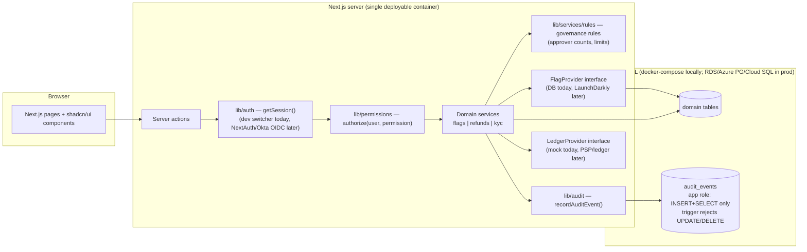

# Architecture — AcmePay Ops Console

One shared foundation, three thin purpose-built apps. Not a Retool clone: a
governed interface for sensitive operational actions.

## Mutation pipeline (every sensitive action)

authenticate (`requireSession`) → authorize (`authorize(user, permission)`,
throws; DENIED attempts are themselves audited) → validate (Zod, structured
errors) → domain service (business rules incl. maker-checker: requester ≠
approver, N approvers from governance rules) → audit event → structured
result. UI hiding/disabling is cosmetic only; everything is re-checked
server-side.

## Boundaries and why

- **Auth seam** (`lib/auth`): `getSession()` is the only identity source.
  Swap the dev cookie switcher for NextAuth + Okta OIDC without touching any
  page or service — the `Session` shape is the contract.
- **Coarse permissions vs. contextual rules**: `authorize()` stays a static
  role→permission map (auditable, testable); contextual policy (approval
  thresholds, refund limits) lives in `GovernanceRule` rows edited on
  `/admin/rules` and interpreted inside domain services. Avoids a policy
  engine while keeping rules centralized. Okta groups could later map to
  roles; rules stay app-owned.
- **Audit at the DB layer**: the runtime role (`app_user`) cannot UPDATE or
  DELETE `audit_events` (grants revoked, trigger as second layer). Both are
  created by Prisma migrations, so any fresh environment gets them. Honest
  caveat: not tamper-evident (no hash chain/WORM; superuser bypasses).
- **Provider interfaces**: `FlagProvider` and `LedgerProvider` isolate the
  parts most likely to be vendor-backed (LaunchDarkly, Stripe/internal
  ledger). Refunds add an idempotency ledger (`ProcessedAction`) so retries
  after failures cannot double-move money.
- **Cloud-agnostic by construction**: the app is one container needing only
  `DATABASE_URL` (runtime, restricted role) and `MIGRATE_DATABASE_URL`
  (migration job). `infra/` sketches Pulumi stacks for ECS Fargate, Azure
  Container Apps, and Cloud Run — mocked, never deployed, no credentials.
  Serverless targets need connection pooling (pgBouncer/RDS Proxy) noted as a
  known gap.

## Key tradeoffs

| Decision | Chose | Over | Why |
|---|---|---|---|
| Authorization | static permission map + DB rules | policy engine (OPA etc.) | 3 apps, ~10 permissions; auditable in one file |
| Approval model | generic maker-checker w/ configurable approver count | per-app bespoke flows | one control reused by flags → refunds → KYC |
| Audit integrity | grants + trigger | hash-chained/WORM store | 10 lines of SQL buys most of the demo value; rest documented |
| Flags | own store behind interface | wrapping LaunchDarkly now | demo needs a source of truth; interface keeps the lazy path open |
| Tests | focused unit + DB integration | broad coverage | prove the security-critical paths (authz, maker-checker, append-only) |

## Known limitations

Mock auth (no real SSO/MFA); audit not tamper-evident; no rate limiting or
CSRF hardening beyond framework defaults; no observability stack; infra is
mocked and CI runs but the deploy job is disabled pending credentials (see
`infra/DEPLOY.md`); single-node Postgres, no HA/backup story.

## Gaps and how to close them

| Gap (today) | Why it matters | Closing move |
|---|---|---|
| Simulated auth + dev user switcher | No real identity, MFA, or session lifecycle | NextAuth + Okta OIDC behind the existing `getSession()` seam; SCIM group→role mapping; delete the switcher in prod builds |
| Audit append-only but not tamper-evident | Compliance needs provable integrity | Ship audit events to WORM storage (e.g. S3 Object Lock) or hash-chain rows; add retention policy |
| Mock ledger provider | No real money moves; reconciliation unproven | Implement `LedgerProvider` against the PSP/internal ledger sandbox; add reconciliation job + alerting on drift |
| DB-backed flag store | Company may already own flags in a vendor | Implement `FlagProvider` against LaunchDarkly API; console becomes governed admin panel over it |
| No deployed environment | Prototype only runs locally | Enable the gated OIDC deploy job with real least-privilege roles (`infra/DEPLOY.md`); managed Postgres + pooling |
| No observability | Can't operate what you can't see | OTel traces + structured logs from the mutation pipeline (correlation IDs already exist); dashboards + alerts |
| Static role→permission map | Role changes need a deploy | Acceptable for 3 roles; if it grows, move mapping to DB/IdP claims — `authorize()` signature doesn't change |
| Single-node Postgres, no DR | Data loss risk | Managed HA Postgres, automated backups, restore runbook |

## Proposed 3-week POC plan

Goal: promote the prototype to a production-credible pilot for one team,
with Devin doing the implementation work under engineer review.

**Week 1 — Identity & environments.** NextAuth + Okta OIDC (real SSO, group→
role mapping, remove dev switcher outside dev); deploy a staging environment
using the existing gated pipeline (one cloud, real deployer role, managed
Postgres + migrations job); secrets in the cloud secret manager.

**Week 2 — Real integrations.** LaunchDarkly-backed `FlagProvider` (or
confirm owning the store); PSP-sandbox `LedgerProvider` with reconciliation
check; WORM/hash-chained audit sink; observability baseline (OTel + alerts on
DENIED spikes and failed ledger calls).

**Week 3 — Pilot & hardening.** Run the KYC queue with the real compliance
team on staging data; load/perf pass; security review (rate limiting, CSRF,
session hardening, pen-test checklist); go/no-go readout comparing run cost +
maintenance burden vs. the Retool line item.

Exit criteria: real SSO logins, one real workflow used by its actual team,
auditable end-to-end trail, deploy pipeline exercised, and a signed-off
build-vs-buy recommendation.
